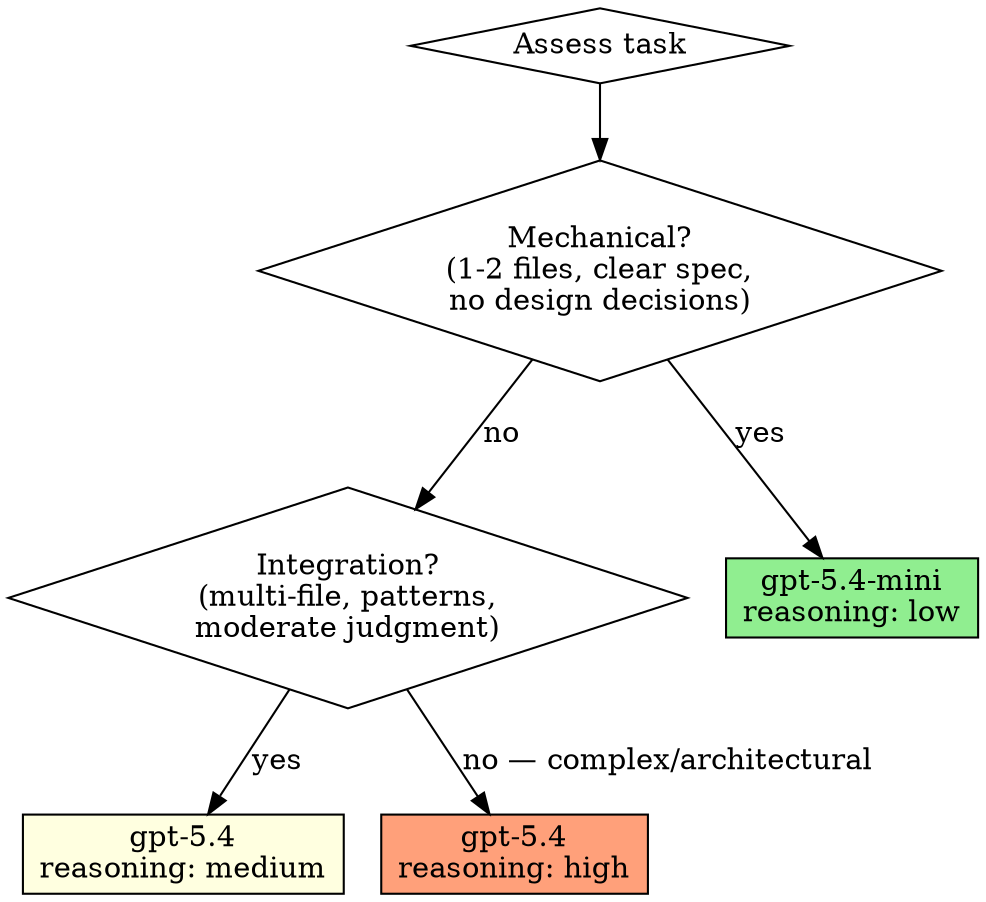
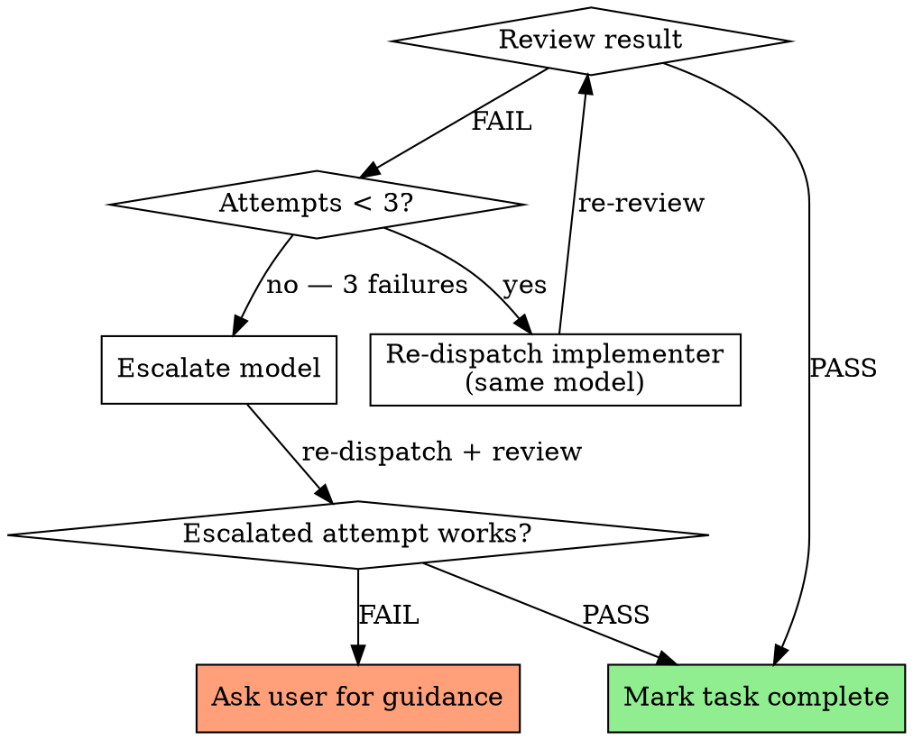
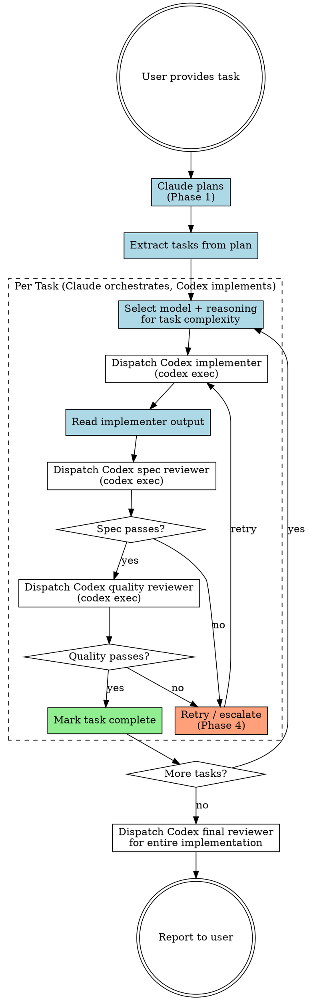

# Codex-Driven Development

## Overview

Claude orchestrates the full workflow — planning, task decomposition, dispatching, and review coordination — while Codex CLI agents write the actual code. Claude never writes implementation code directly. Codex agents are dispatched via `codex exec` with model and reasoning level chosen per-task based on complexity.

**Announce at start:** "I'm using Codex-Driven Development — I'll plan the work and dispatch Codex agents to implement it."

## When to Use

- You have a multi-step implementation task (3+ steps or architectural decisions)
- You want code written by Codex agents, not Claude
- Tasks can be decomposed into independent or sequential units of work

**Don't use when:**
- Single trivial change (just dispatch one codex exec directly)
- Task requires Claude-specific tools (MCP, web fetch, etc.) for implementation
- User explicitly asks Claude to write the code

## Phase 1: Planning

**Claude writes the entire plan. Codex agents never plan.**

Follow the same planning process as superpowers:writing-plans:

1. Understand the task, explore the codebase, ask clarifying questions
2. Write a comprehensive implementation plan with bite-sized tasks
3. Save plan to `docs/superpowers/plans/YYYY-MM-DD-<feature-name>.md`
4. Each task must have: exact file paths, complete code, exact test commands, expected output

**Plan header must include:**

```markdown
# [Feature Name] Implementation Plan

> **Execution:** This plan is executed via codex-driven-development. Claude orchestrates; Codex agents implement.

**Goal:** [One sentence]
**Architecture:** [2-3 sentences]
**Tech Stack:** [Key technologies]

---
```

Task structure follows superpowers:writing-plans format — steps with checkboxes, exact code, exact commands.

## Phase 2: Codex Dispatch

### Dispatch Syntax

```bash
codex exec \
  --model <model> \
  -c 'model_reasoning_effort = "<level>"' \
  --full-auto \
  "<prompt>"
```

Key flags:
- `--model` / `-m`: Select model (see Model Selection below)
- `-c 'model_reasoning_effort = "<level>"'`: Set reasoning effort
- `--full-auto`: Non-interactive with workspace write access
- `-C <dir>`: Set working directory (if different from current)

### Injecting Project Rules

Before dispatching any Codex agent, Claude MUST read and extract relevant rules from:

1. **Global instructions:** `~/.claude/CLAUDE.md` (if exists)
2. **Project instructions:** `CLAUDE.md` in the project root (if exists)
3. **Nested instructions:** Any `.claude/CLAUDE.md` in relevant subdirectories

Extract rules that are relevant to the implementation task (coding conventions, testing requirements, commit style, architectural constraints, etc.) and inject them into the Codex prompt under a `## Project Rules` section:

````
## Project Rules (from CLAUDE.md — follow these strictly)

- [Extracted rule 1]
- [Extracted rule 2]
- ...
````

**What to include:** Coding standards, test requirements, naming conventions, framework constraints, directory structure rules, forbidden patterns.

**What to skip:** Claude-specific workflow instructions (plan mode, subagent strategy, task tracking) — these are orchestrator concerns, not implementer concerns.

### Model Selection

Choose the model and reasoning level based on task complexity:



| Task Type | Model | Reasoning | When |
|-----------|-------|-----------|------|
| Mechanical | `gpt-5.4-mini` | `low` | Isolated function, clear spec, 1-2 files, no design decisions |
| Standard | `gpt-5.4` | `medium` | Multi-file changes, pattern matching, moderate judgment |
| Complex | `gpt-5.4` | `high` | Architectural decisions, cross-cutting concerns, debugging |
| Review | `gpt-5.4` | `medium` | All review tasks (spec compliance + code quality) |

### Implementer Prompt Template

When dispatching a Codex agent to implement a task, construct the prompt as follows:

````
You are implementing Task N: [task name]

## Task Description

[FULL TEXT of task from plan — paste complete, don't reference external files]

## Context

[Scene-setting: where this fits in the project, dependencies, what was built before this task]

## Working Constraints

- Implement EXACTLY what the task specifies — nothing more, nothing less
- Follow TDD: write failing test first, then implement, then verify
- Follow existing codebase patterns and conventions
- Do NOT restructure code outside your task scope
- Do NOT run any git commands (no git add, git commit, git push, etc.) — leave all commits to the user

## Report Format (REQUIRED)

You MUST end your output with a structured report so the orchestrator can verify your work and dispatch reviewers. Use this exact format:

```
=== TASK REPORT ===
Status: DONE | DONE_WITH_CONCERNS | BLOCKED

Files Changed:
- [created/modified/deleted] path/to/file.py — [what this file does / what changed]

Implementation Summary:
- [Bullet points describing what you built and key decisions made]

Tests:
- [Test name]: PASS/FAIL — [what it verifies]
- [Test name]: PASS/FAIL — [what it verifies]
- Run command: [exact command used]
- Result: [N passed, N failed]

Concerns: [Any doubts, edge cases not covered, or things the reviewer should look at. "None" if clean.]
=== END REPORT ===
```

If BLOCKED: describe specifically what you're stuck on, what you tried, and what information or changes would unblock you.
````

**Example dispatch:**

```bash
codex exec \
  --model gpt-5.4-mini \
  -c 'model_reasoning_effort = "low"' \
  --full-auto \
  "You are implementing Task 1: Add input validation to the parser.

## Task Description

### Task 1: Input Validation

**Files:**
- Create: src/validation.py
- Test: tests/test_validation.py

- [ ] Step 1: Write failing test for empty input
\`\`\`python
def test_rejects_empty_input():
    with pytest.raises(ValueError):
        validate_input('')
\`\`\`

- [ ] Step 2: Implement validate_input
\`\`\`python
def validate_input(data: str) -> str:
    if not data.strip():
        raise ValueError('Input cannot be empty')
    return data.strip()
\`\`\`

## Context

This is the first task. No dependencies. The parser module is in src/parser.py.

## Working Constraints

- Implement EXACTLY what the task specifies
- Follow TDD: write failing test, implement, verify
- Do NOT run any git commands — no commits, no staging, nothing

## Report Format (REQUIRED)

End with a structured report:
\`\`\`
=== TASK REPORT ===
Status: DONE | DONE_WITH_CONCERNS | BLOCKED
Files Changed: [created/modified] path — [what changed]
Implementation Summary: [bullet points]
Tests: [test name]: PASS/FAIL — [what it verifies]
Run command: [command used]
Result: [N passed, N failed]
Concerns: [any doubts or 'None']
=== END REPORT ===
\`\`\`"
```

## Phase 3: Review

After each Codex implementer finishes, dispatch two review agents sequentially.

### Review 1: Spec Compliance

Dispatch a Codex agent to verify the implementation matches the spec:

```bash
codex exec \
  --model gpt-5.4 \
  -c 'model_reasoning_effort = "medium"' \
  --full-auto \
  "You are reviewing whether Task N's implementation matches its specification.

## What Was Requested

[FULL TEXT of task requirements from plan]

## Implementer's TASK REPORT

[Paste the implementer's === TASK REPORT === section verbatim here]

## Your Job

Read the actual code. Do NOT trust the report — verify everything independently.

Check:
1. **Missing requirements** — anything from the spec not implemented?
2. **Extra work** — anything built that wasn't requested?
3. **Misunderstandings** — requirements interpreted incorrectly?
4. **Tests** — do tests actually verify the specified behavior?

Report:
- PASS: All requirements met, nothing extra, tests verify behavior
- FAIL: [List specific issues with file:line references]"
```

### Review 2: Code Quality

Only dispatch after spec compliance passes:

```bash
codex exec \
  --model gpt-5.4 \
  -c 'model_reasoning_effort = "medium"' \
  --full-auto \
  "You are reviewing code quality for Task N.

## What Was Built

[Summary of implementation]

## Review the changed files for:

1. **Correctness** — edge cases, error handling, off-by-one errors
2. **Clarity** — naming, structure, readability
3. **Maintainability** — single responsibility, clean interfaces
4. **Testing** — coverage, test quality, assertions meaningful
5. **Conventions** — follows existing codebase patterns

Report:
- PASS: Code is clean, well-tested, maintainable
- FAIL: [List issues as Critical/Important/Minor with file:line references]"
```

## Phase 4: Retry & Escalation



**Retry rules:**

One "attempt" = dispatch implementer + run both reviews. Track attempt count per task.

1. **Review fails (attempt < 3)** → Re-dispatch implementer with the SAME model, including the reviewer's feedback verbatim in the prompt. "The reviewer found these issues: [feedback]. Fix them."
2. **3 failed attempts at same model** → Escalate model:
   - `gpt-5.4-mini` → `gpt-5.4` with `medium` reasoning
   - `gpt-5.4` medium → `gpt-5.4` with `high` reasoning
   - `gpt-5.4` high → `gpt-5.4` with `xhigh` reasoning
   After escalation, reset attempt counter to 0 for the new model level. Allow up to 3 attempts at the escalated level.
3. **Escalated model still fails after 3 attempts** → Stop and ask the user. Present: what was attempted across all levels, what failed, all reviewer feedback.

**When re-dispatching with feedback:**

```bash
codex exec \
  --model gpt-5.4 \
  -c 'model_reasoning_effort = "medium"' \
  --full-auto \
  "You are FIXING Task N: [task name]

## Original Task
[Full task text]

## Previous Attempt Issues
The reviewer found these problems:
[Paste reviewer's FAIL output verbatim]

## Your Job
Fix ONLY the issues listed above. Do not rewrite working code.
Run tests to verify fixes. Do NOT run any git commands.

## Report Format (REQUIRED)

End with a structured report:
\`\`\`
=== TASK REPORT ===
Status: DONE | DONE_WITH_CONCERNS | BLOCKED
Files Changed: [created/modified] path — [what changed]
Implementation Summary: [what you fixed]
Tests: [test name]: PASS/FAIL — [what it verifies]
Run command: [command]
Result: [N passed, N failed]
Concerns: [any remaining doubts or 'None']
=== END REPORT ===
\`\`\`"
```

## The Full Process



**Blue nodes = Claude does this. White nodes = Codex does this.**

## Reading Codex Output

After each `codex exec`, Claude must:

1. **Parse the `=== TASK REPORT ===`** from stdout — extract status, files changed, test results, and concerns
2. **Check git status/diff** to verify what files actually changed matches the report
3. **Handle by status:**
   - **DONE:** Proceed to spec compliance review, passing the full TASK REPORT to the reviewer
   - **DONE_WITH_CONCERNS:** Read concerns carefully. If about correctness/scope, address before review. If observations, note and proceed to review.
   - **BLOCKED:** Assess whether to provide more context, escalate model, or break task down
4. **Run tests yourself** (via Bash) to independently verify the implementer's claimed test results

**If `=== TASK REPORT ===` is missing from output:** Treat as a failed attempt. Check git diff to see if work was done, then re-dispatch with explicit instruction to include the report. Counts toward the 3-attempt retry limit.

**Do NOT trust the report blindly** — verify test results independently, and the review agents verify code quality.

## Red Flags

**Never:**
- Let Codex agents plan or decompose tasks (Claude plans, Codex implements)
- Skip either review stage (spec compliance AND code quality are both required)
- Dispatch multiple Codex implementers in parallel on the same repo (file conflicts)
- Retry more than 3 times at the same model without escalating
- Escalate past `xhigh` reasoning without asking the user
- Proceed to next task while review has open issues
- Write implementation code yourself instead of dispatching Codex
- Let Codex agents run git commands (no commits, staging, or pushes — that's the user's job)
- Dispatch Codex without injecting relevant CLAUDE.md project rules

**Always:**
- Paste full task text into the Codex prompt (don't reference plan file paths)
- Include reviewer feedback verbatim when re-dispatching
- Track attempt count per task for retry logic
- Run spec compliance review BEFORE code quality review
- Use `--full-auto` flag for non-interactive execution
- Read and inject relevant CLAUDE.md rules into every Codex prompt
- Independently verify test results after implementer reports DONE
- Require structured `=== TASK REPORT ===` output from every Codex agent

## Integration

**Works with:**
- **superpowers:writing-plans** — Same planning format and process
- **superpowers:brainstorming** — Run before planning for requirements clarity
- **superpowers:using-git-worktrees** — Isolate work in a worktree before starting
- **superpowers:finishing-a-development-branch** — Complete development after all tasks

**Replaces (when using Codex):**
- **superpowers:subagent-driven-development** — This skill uses Codex agents instead of Claude subagents

## Quick Reference

| Phase | Who | What |
|-------|-----|------|
| Planning | Claude | Write full implementation plan with bite-sized tasks |
| Rules Injection | Claude | Read CLAUDE.md files, extract relevant rules for Codex prompts |
| Dispatch | Claude | Select model/reasoning, construct prompt with rules + task, run `codex exec` |
| Implement | Codex | Write code and tests — no git commands, structured TASK REPORT output |
| Verify | Claude | Parse TASK REPORT, run tests independently, check git diff |
| Spec Review | Codex | Verify implementation matches spec (PASS/FAIL) |
| Quality Review | Codex | Verify code quality (PASS/FAIL) |
| Retry | Claude | Re-dispatch with feedback, escalate model if needed |
| Escalate | Claude | Ask user after model escalation exhausted |
| Commit | User | All git commits are manual — Claude reports what's ready to commit |
